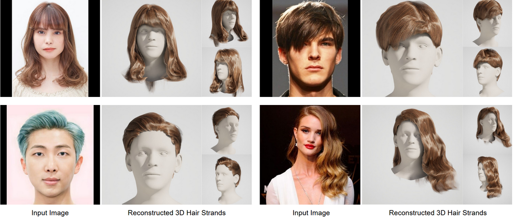

## :woman: Im2Haircut: Single-view Strand-based Hair Reconstruction for Human Avatars [ICCV 2025]

*Generation strand-based hairstyle from single image.*


[[Paper](https://arxiv.org/abs/2509.01469)] [[Project Page](https://im2haircut.is.tue.mpg.de/)] [[Video](https://www.youtube.com/watch?v=7CPsjuBW_10&t=72s)]

<p align="left"> 

</p>

## Getting started


1) Install CUDA 11.8

Follow the instructions on https://developer.nvidia.com/cuda-11-8-0-download-archive.

Make sure that

    PATH includes <CUDA_DIR>/bin
    LD_LIBRARY_PATH includes <CUDA_DIR>/lib64

The environment was tested only with this CUDA version.

2) Clone repo, download checkpoints and preprocessed example data:

```bash
git clone --recurse-submodules https://github.com/Vanessik/Im2Haircut
cd Im2Haircut
chmod +x ./install.sh
./install.sh
```

## 🧪 Try on Our Data


1. **Launch the demo:**

```bash
bash ./scripts/static.sh
```

2. Find results in the folder: ```./exps_inverse_stage/try/examples/{IMG_NAME}```


3. Visualize results using tensorbard:

```bash
tensorboard --logdir ./exps_inverse_stage --port 6008
```


## 🧩 Try on Your Own Data

To run the pipeline on your own images, first download the model checkpoints and install all required submodules and environments:


```bash
chmod +x ./install_submodules.sh
./install_submodules.sh
```

Then follow these steps:

1. Place your input images in ```./data/new_data/img```

2. Compute preprocessing data (masks, orientation maps, depth maps, and cameras):
```bash
bash ./scripts/preprocess_any_data.sh
```

3) Run the main inference:
```bash
bash ./scripts/static.sh
```


💻 Code was tested on NVIDIA A100 GPU.


## License

This code is based on the 3D Gaussian Splatting project. For terms and conditions, please refer to LICENSE_3DGS. The rest of the code is distributed under CC BY-NC-SA 4.0.

If this code is helpful in your project, cite the papers below.


## Links

This work is based on the great projects:

- [Hairstep](https://paulyzheng.github.io/research/hairstep/) calculation direction map;

- [PERM](github.com/c-he/perm) basis implementation;

- [NeuS](https://github.com/Totoro97/NeuS) learning head signed distance function;

- [Deep3DFaceRecon_pytorch](https://github.com/sicxu/Deep3DFaceRecon_pytorch) camera estimation;

- [GaussianHaircut](https://github.com/eth-ait/GaussianHaircut) hairstyle rasterization using gaussian splatting;

- [ml-depth-pro](https://github.com/apple/ml-depth-pro) depth estimation;

- [VOODOO3D-official](https://github.com/mbzuai-metaverse/VOODOO3D-official) implementation of transformer architecture;


## Citation

```
@article{sklyarova2025im2haircut,
    title={Im2Haircut: Single-view Strand-based Hair Reconstruction for Human Avatars},
    author=Sklyarova, Vanessa and Zakharov, Egor and Prinzler, Malte and Becherini, Giorgio and Black, Michael and Thies, Justus},
    journal={ArXiv},
    month={Sep}, 
    year={2025} 
}
```